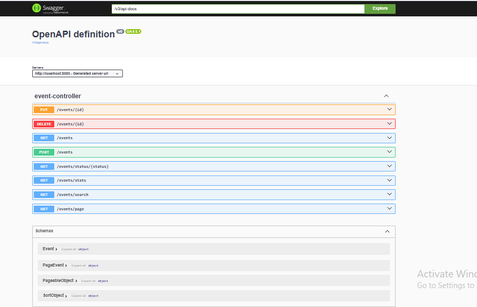
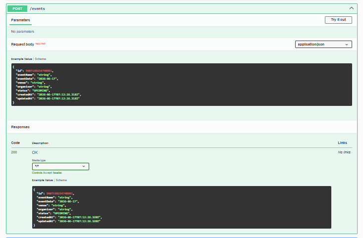
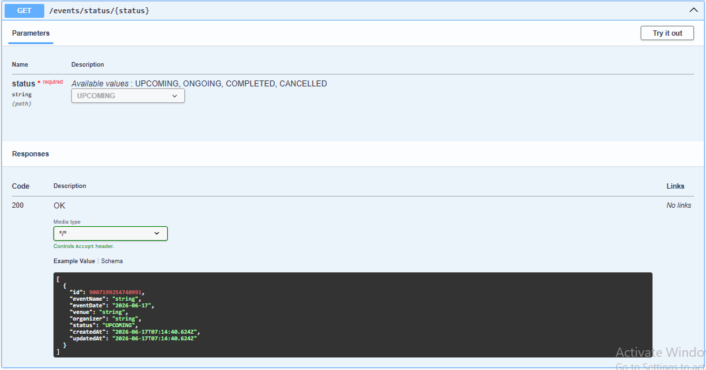
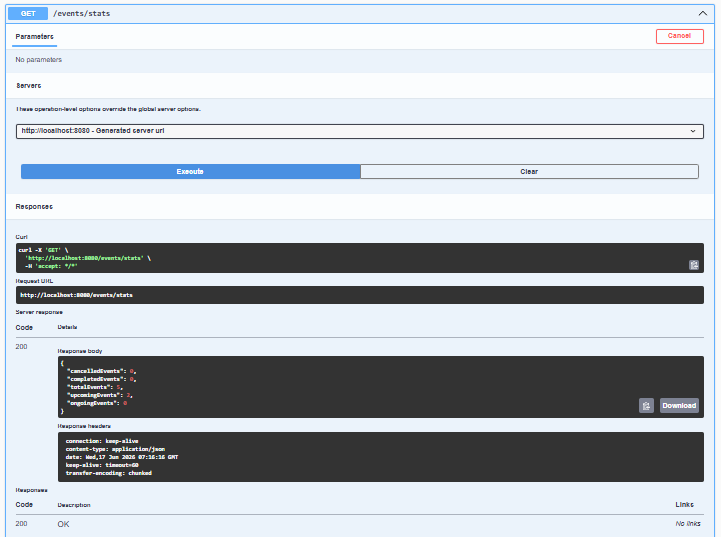

# Event Management System

A Spring Boot REST API application for managing events with PostgreSQL integration.

## Features

- Create Event
- Get All Events
- Update Event
- Delete Event
- Search Events by Name
- Filter Events by Status
- Pagination & Sorting
- Event Statistics Dashboard
- Global Exception Handling
- Swagger API Documentation

## Tech Stack

- Java 17
- Spring Boot
- Spring Data JPA
- Hibernate
- PostgreSQL
- Maven
- Swagger/OpenAPI
- Git & GitHub

## API Endpoints

### Event Management

- POST /events
- GET /events
- PUT /events/{id}
- DELETE /events/{id}

### Search & Filtering

- GET /events/search?name=
- GET /events/status/{status}

### Pagination

- GET /events/page?page=0&size=5&sortBy=eventName

### Statistics

- GET /events/stats

## Swagger Documentation

Access Swagger UI:

http://localhost:8080/swagger-ui/index.html

## Screenshots

### Swagger Documentation

### Create Event API

### Status Filtering

### Event Statistics

## Author

Anwesha Das Gupta
